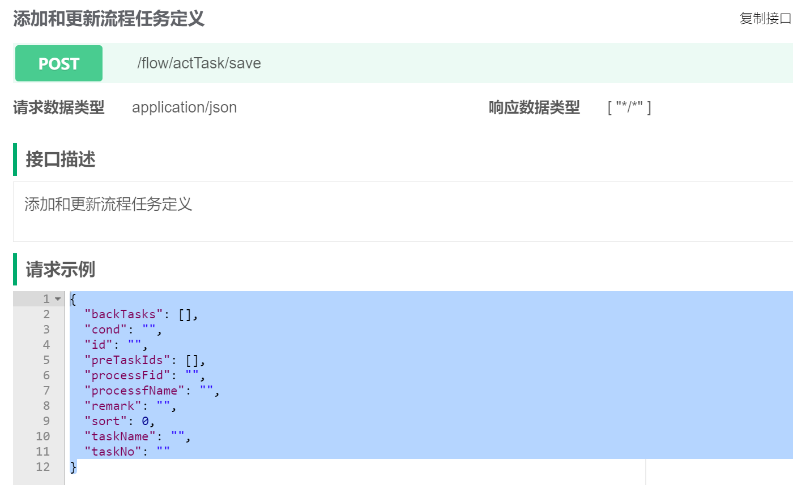
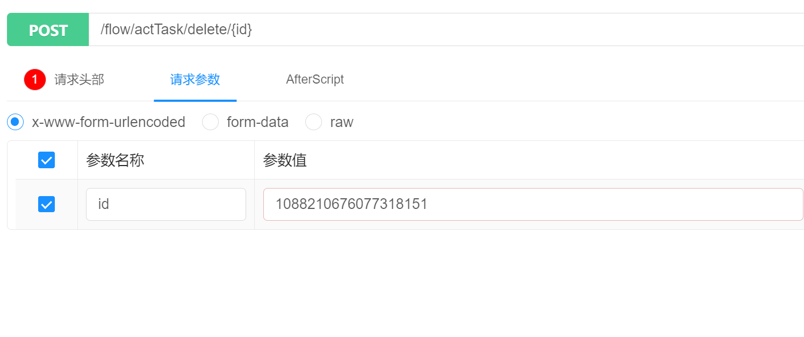
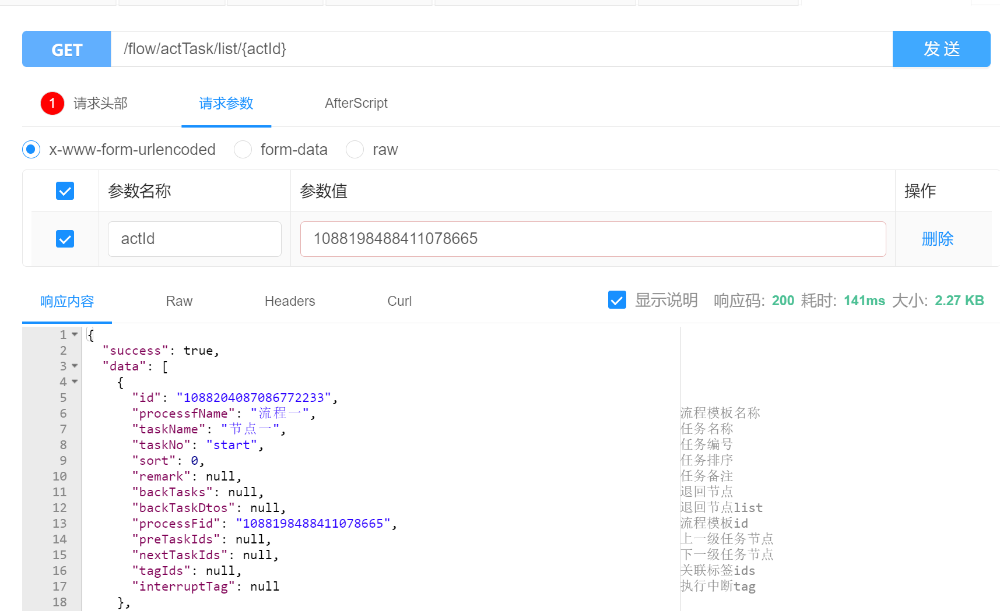
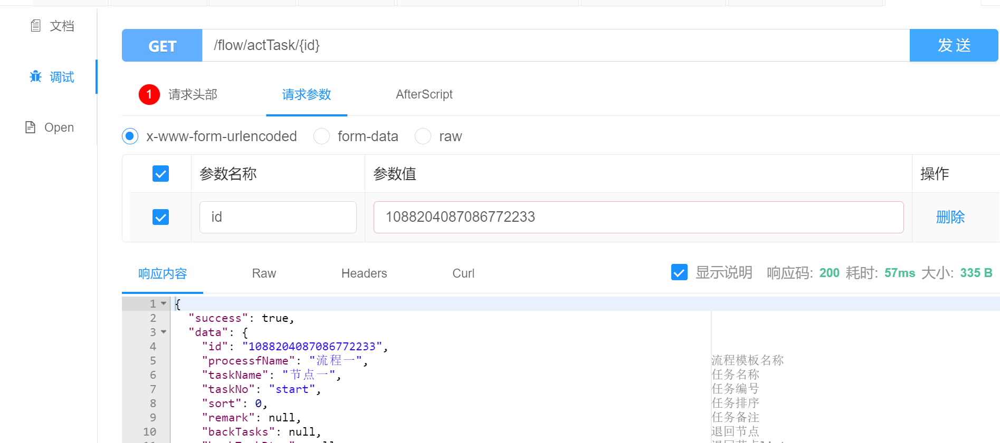
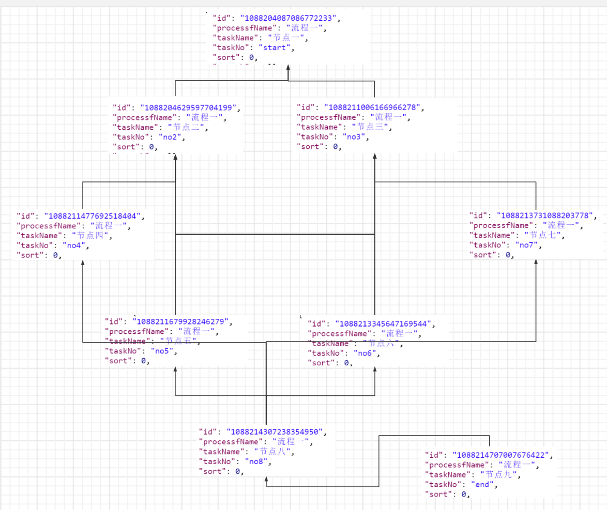
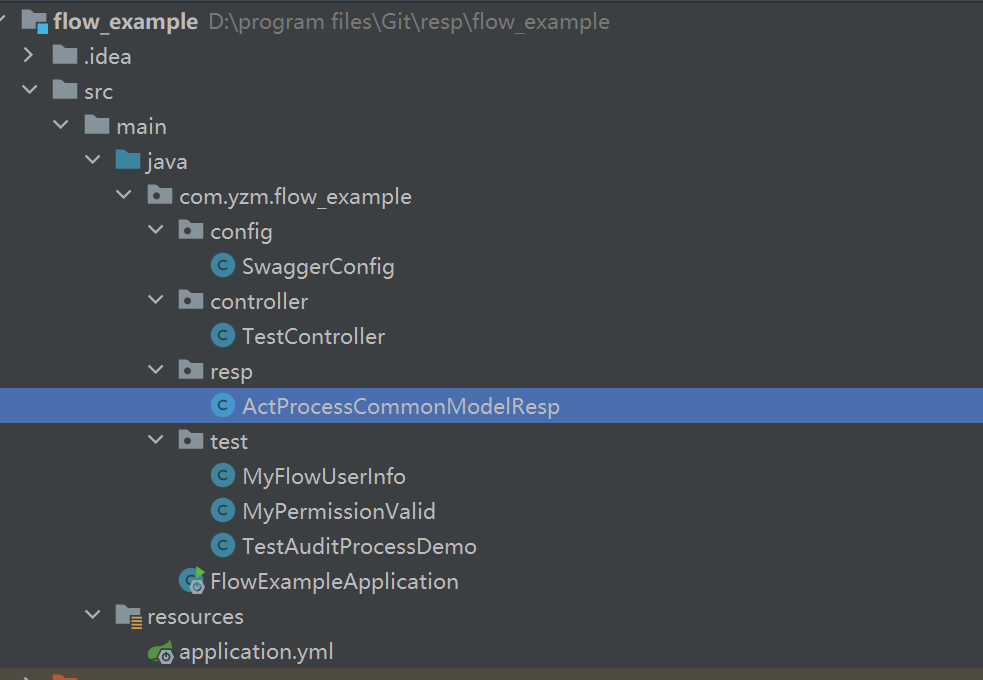
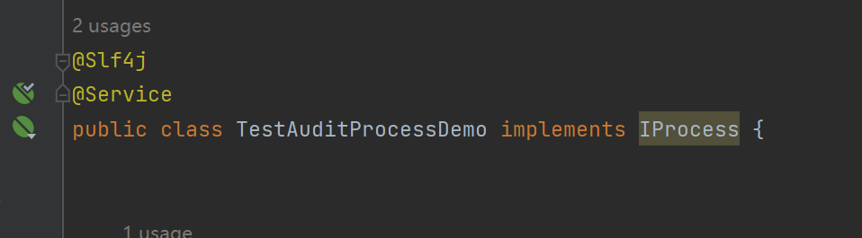

### **审批流程3.1.0**


当前版本3.1.0
完成主要功能：增加同步调用功能


当前包主要功能：审批工作流程封装

配置属性详细信息如下：

yzm.flow.joinuser=true/false 是否加入业务系统的用户操作信息

    默认为false,开启后需要实现接口com.sophony.flow.worker.base.FlowUserInfo,
    获取业务系统用户信息，之后流程数据操作记录就会出现用户的详细


yzm.flow.rolevalid=true/false 是否加入业务系统的角色权限校验

    默认为false,开启后需要实现com.sophony.flow.worker.base.PermissionValid接口,开启用户对审核节点的权限校验，
    这里是把当前流程所有可审核的节点传输到业务系统，有业务系统根据TaskNode中taskTemplateId任务节点模板id对用户角色的权限
    进行过滤。然后返回将过滤好的TaskNode返回回去
    （用户可能有多个可审核的节点， 但一次只能审核一个节点，所以尽量不要动传输到业务系统TaskNode顺序）

yzm.flow.sqlType=mysql/postgresql 数据库类型 可选 默认postgresql

    数据库类型，做到尽可能方便开发人员，项目启动会自动刷入当前包应用的数据和表

yzm.flow.openCache=true/false 是否开启缓存

    默认开启缓存，审批流程需要大量查表，开启之后减少io开销

yzm.flow.cacheType=redis/H2 缓存类型

    默认的缓存是H2，放在本地磁盘中，也可以使用redis


### 使用方式
  1. 将源码打包，在自己spring-boot项目中引入依赖
    
```
  <dependency>
       <groupId>com.sophony.flow</groupId>
       <artifactId>flow-yzm-starter</artifactId>
       <version>3.0.0</version>
   </dependency>
```
   

   	将流程依赖包引入，然后在项目的application.yml中按照上面配置介绍结合自己所需配置
##### 流程模板


   


  1. 创建或更新流程模板

   &nbsp;&nbsp;&nbsp;&nbsp;&nbsp;&nbsp;路由：${host}:${port}/**/flow/actProcdef/save,其中的/**可以没有，是根据项目实际配置来的，

   &nbsp;&nbsp;&nbsp;&nbsp;&nbsp;&nbsp;参数说明：

| 字段名 | 字段描述 |
|-----|------|
|   actName  | 流程名称 |
|  actNo   | 流程编号 |
|  description   | 流程描述 |
|   id  | 流程id |
   
   &nbsp;&nbsp;&nbsp;&nbsp;&nbsp;&nbsp;请求方式：POST

   &nbsp;&nbsp;&nbsp;&nbsp;&nbsp;&nbsp;请求示例：

   
  2. 复制流程模板

   &nbsp;&nbsp;&nbsp;&nbsp;&nbsp;&nbsp;路由：/flow/actProcdef/copy

   &nbsp;&nbsp;&nbsp;&nbsp;&nbsp;&nbsp;请求方式：GET

   &nbsp;&nbsp;&nbsp;&nbsp;&nbsp;&nbsp;请求示例：

   

   &nbsp;&nbsp;&nbsp;&nbsp;&nbsp;&nbsp;入参的id是已经生成流程模板id，如果流程模板已经有流程任务模板，本次任务会连同复制

  3. 删除流程模板

   &nbsp;&nbsp;&nbsp;&nbsp;&nbsp;&nbsp;路由：/flow/actProcdef/delete

   &nbsp;&nbsp;&nbsp;&nbsp;&nbsp;&nbsp;请求方式：GET

   &nbsp;&nbsp;&nbsp;&nbsp;&nbsp;&nbsp;请求示例：

  
  &nbsp;&nbsp;&nbsp;&nbsp;&nbsp;&nbsp;根据流程模板id删除流程模板

  4. 获取流程模板详情

   &nbsp;&nbsp;&nbsp;&nbsp;&nbsp;&nbsp;路由：/flow/actProcdef/delete

   &nbsp;&nbsp;&nbsp;&nbsp;&nbsp;&nbsp;请求方式：GET

   &nbsp;&nbsp;&nbsp;&nbsp;&nbsp;&nbsp;请求示例：
   

&nbsp;&nbsp;&nbsp;&nbsp;&nbsp;&nbsp;响应参数说明：

| 字段名         | 字段描述 |
|-------------|------|
| actName     | 流程名称 |
| actNo       | 流程编号 |
| description | 流程描述 |
| id          | 流程id |
| version     | 版本   |

  5. 获取所有流程

     &nbsp;&nbsp;&nbsp;&nbsp;&nbsp;&nbsp;路由：/flow/actProcdef/list

     &nbsp;&nbsp;&nbsp;&nbsp;&nbsp;&nbsp;请求方式：GET

     &nbsp;&nbsp;&nbsp;&nbsp;&nbsp;&nbsp;请求示例：
     

  6. 激活/冻结流程模板

     &nbsp;&nbsp;&nbsp;&nbsp;&nbsp;&nbsp;路由：/flow/actProcdef/updateState

     &nbsp;&nbsp;&nbsp;&nbsp;&nbsp;&nbsp;请求方式：GET

     &nbsp;&nbsp;&nbsp;&nbsp;&nbsp;&nbsp;请求示例：
  
     
     在实际业务中只有开启流程时，只有激活的模板才能使用。 模板编号可以重复，但是相同编号模板只能激活一个

##### 任务模板
&nbsp;&nbsp;&nbsp;&nbsp;&nbsp;&nbsp;任务模板必须关联流程模板， 一个流程模板能关联多个任务模板， 一个流程模板中的任务模板必须包含 start 编号任务模板和 end 编号任务模板，否则任务流程无法工作

  1. 添加和更新流程任务定义

     &nbsp;&nbsp;&nbsp;&nbsp;&nbsp;&nbsp;路由：/flow/actTask/save

     &nbsp;&nbsp;&nbsp;&nbsp;&nbsp;&nbsp;请求方式：POST

     &nbsp;&nbsp;&nbsp;&nbsp;&nbsp;&nbsp;请求示例：
     
     
     &nbsp;&nbsp;&nbsp;&nbsp;&nbsp;&nbsp;请求参数说明：


| 字段名         | 字段描述                                  |
|-------------|---------------------------------------|
| backTasks     | array 回退节点模板，                         |
| cond       | 条件 值为 and 或 or 默认为and ，当前节点有多个父节点可以使用 |
| id | 任务id                                  |
| preTaskIds          | array preTaskIds 父节点模板，               |
| processFid     | 流程模板id, 必填                            |
| processfName     | 流程模板名称                                |
| remark     | 任务备注                                  |
| sort     | 任务排序                                  |
| taskName     | 任务名称                                  |
| taskNo     | 任务编号                                  |


  2. 删除流程任务模板节点

     &nbsp;&nbsp;&nbsp;&nbsp;&nbsp;&nbsp;路由：/flow/actTask/delete/{id}

     &nbsp;&nbsp;&nbsp;&nbsp;&nbsp;&nbsp;请求方式：POST

     &nbsp;&nbsp;&nbsp;&nbsp;&nbsp;&nbsp;请求示例：
    
  3. 根据流程模板id查询节点

     &nbsp;&nbsp;&nbsp;&nbsp;&nbsp;&nbsp;路由：/flow/actTask/list/{actId}

     &nbsp;&nbsp;&nbsp;&nbsp;&nbsp;&nbsp;请求方式：GET

     &nbsp;&nbsp;&nbsp;&nbsp;&nbsp;&nbsp;请求示例：
    
  
  4. 查询详情
     &nbsp;&nbsp;&nbsp;&nbsp;&nbsp;&nbsp;路由：/flow/actTask/{id}

     &nbsp;&nbsp;&nbsp;&nbsp;&nbsp;&nbsp;请求方式：GET

     &nbsp;&nbsp;&nbsp;&nbsp;&nbsp;&nbsp;请求示例：
    


##### 业务中使用


     在实际业务中，我们的审核同意、审核拒绝走统一的接口，不再走自定义的审核的接口，（特殊情况下可以自己手动控制流程，不走统一审核流程）
     
     IProcess 统一审核时回调，流程开启回到，分为审核前回调、审核后回调、审核结束回调
          --auditAfter （同步调用）审核前回调，默认返回true， 业务类可重写，根据自己的业务来决定当前流程是否可以审核，返回false，当前审核取消
               --入参：ProcessCommonModel
                    --processId:流程Id
                    --taskNode: TaskNode 当前审核的任务节点
                    --businessParams:审核时代入额外参数，可自定义作业
                    --operation：当前审核动作， （审核同意， 审核拒绝， 撤回）
                    --processTemplateId:当前审核流程模板id
          --auditBefore （异步/同步调用）审核后调用， 当前任务节点审核结束后，
               --入参：ProcessCommonModel
                    --processId:流程Id
                    --taskNode: TaskNode 当前审核的任务节点
                    --businessParams:审核时代入额外参数，可自定义作业
                    --operation：当前审核动作， （审核同意， 审核拒绝， 撤回）
                    --finishNode：当前审批完成任务节点
                    --processTemplateId:当前审核流程模板id
          --goEndBack （异步/同步调用）流程结束回调，

&nbsp;&nbsp;&nbsp;&nbsp;&nbsp;&nbsp;构建以下流程:




1.创建spring-boot工程




1.创建demo 

```
@Service
public class DemoService implements IProcess{

     XXXX

}


```


   


   


    


